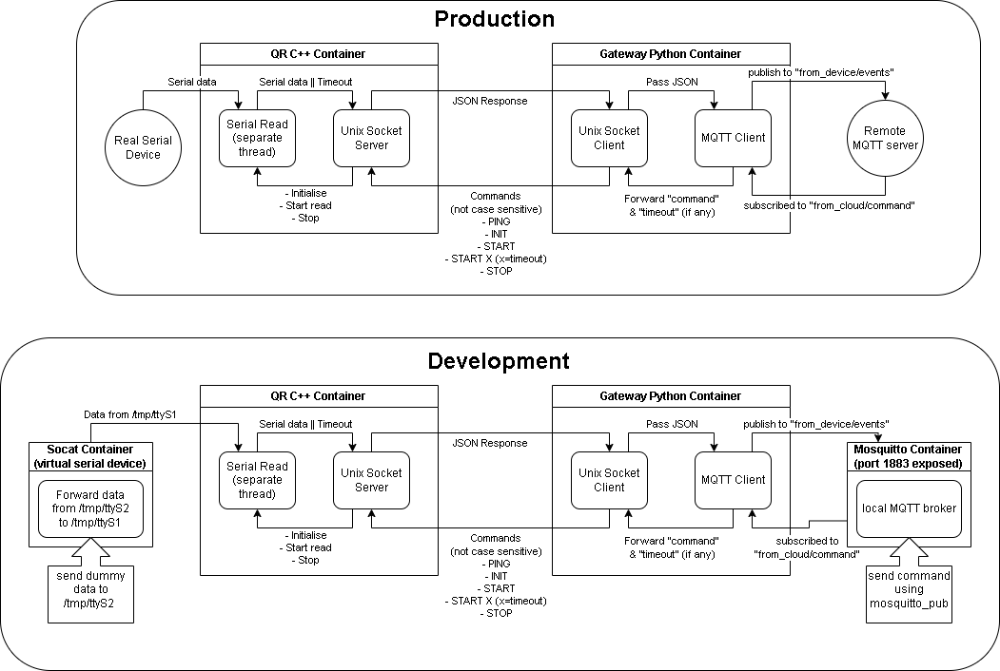

# QR Code Gateway — Embedded Challenge
A containerised system that reads QR codes from a serial port and forwards them to the cloud via MQTT. The system is split into two services: a C++ serial reader (`qr-c`) and a Python MQTT gateway (`gateway-py`).
## Table of Contents

- [Architecture](#architecture)
- [Repository Structure](#repository-structure)
- [Prerequisites](#prerequisites)
- [How to Run](#how-to-run)
  - [Development (mocked serial + local MQTT broker)](#development-mocked-serial--local-mqtt-broker)
  - [Production (real serial device + remote MQTT broker)](#production-real-serial-device--remote-mqtt-broker)
  - [Stopping](#stopping)
  - [Modifying virtual environment variables](#modifying-virtual-environment-variables)
- [How to Test - Development mode](#how-to-test---development-mode)
  - [1 — Send a command from the cloud](#1--send-a-command-from-the-cloud)
  - [2 — Simulate a QR code scan](#2--simulate-a-qr-code-scan)
  - [3 — Monitor events from the device](#3--monitor-events-from-the-device)
- [How to Test - Production mode](#how-to-test---production-mode)
- [Assumptions](#assumptions)
- [Missing Functionality](#missing-functionality)
- [Untested Functionality](#untested-functionality)
- [Design Decisions](#design-decisions)
- [Future Improvements](#future-improvements)
- [A comment on use of AI (LLMs)](#a-comment-on-use-of-ai-llms)


---

## Architecture



**Main Docker Containers:**
- **qr-c**: Opens a serial port, listens for commands from `gateway-py` over a Unix socket, and responds with JSON-encoded QR data.
- **gateway-py**: Connects to an MQTT broker, translates cloud commands into socket commands for `qr-c`, and publishes QR events back to the cloud.

**Helper Docker Containers (for development & testing):** 
- **fake-serial** (socat): generates two connected PTY devices (virtual). Serial data can be be mocked by sending to one of them, which is then forwarded to the other.
- **mosquitto** (mosquitto): runs and exposes an MQTT broker, which automatically handles client connections and forwarding of published messages to subscribers.

**Communication**:
  - Serial comminication with real or PTY devices
  - Unix socket for local IPC
  - MQTT over TLS for cloud communication.

---

## Repository Structure

```
.
├── diagrams/
│   ├── diagram.svg
│   └── diagram.png
├── qr-c/
│   ├── src/
│   │   ├── logger.cpp
│   │   ├── logger.h
│   │   ├── main.cpp
│   │   ├── serial.cpp
│   │   ├── serial.h
│   │   ├── socket.cpp
│   │   └── socket.h
│   ├── CMakeLists.txt
│   └── Dockerfile
├── gateway-py/
│   ├── app.py
│   ├── requirements.txt
│   └── Dockerfile
├── mosquitto/
│   └── config/
│       └── mosquitto.conf
├── docker-compose.yml
├── docker-compose.dev.yml
├── docker-compose.prod.yml
├── docker_up.bat
├── Makefile
└── README.md
```

---

## Prerequisites

- Docker and Docker Compose
- make (only for Linux)

---

## How to Run

### Development (mocked serial + local MQTT broker)

#### For Linux
```bash
make dev
```

#### For Windows
```bash
docker_up.bat dev
```

This starts four containers:
- `fake-serial` — simulates a serial port using `socat`
- `qr-c` — the C++ serial reader
- `gateway-py` — the Python MQTT gateway
- `mosquitto` — a local MQTT broker (no TLS)

### Production (real serial device + remote MQTT broker)

#### For Linux
```bash
make prod
```

#### For Windows
```bash
docker_up.bat prod
```

This starts two containers:
- `qr-c` — connects to the real serial device (default: `/dev/ttyUSB0`)
- `gateway-py` — connects to `test.mosquitto.org` over TLS on port 8883

### Stopping

#### For Linux
```bash
make down
```

#### For Windows
```bash
docker_up.bat down
```

### Modifying virtual environment variables
Enviroment variables are changed directly in the respective `docker_compose*.yml` files, meaning no modifications to the `Dockerfile`s or code are required.

---

## How to Test - Development mode

### 1 — Send a command from the cloud
In development mode, open a shell on the mosquitto container (or add the `-c` flag to send command in the same line)

```bash
docker compose exec fake-serial sh  # for control
```
Publish a command to the local broker. Keep in mind that serial needs to be initialised before reading from it. For example:
```bash
mosquitto_pub -h localhost -p 1883 \
  -t "from_cloud/command" \
  -m '{"command": "init"}'

mosquitto_pub -h localhost -p 1883 \
  -t "from_cloud/command" \
  -m '{"command": "start", "timeout": 5000}'
```

Available commands (not case sensitive):
| Command  | Description |
|----------|-------------|
| `INIT`   | Initialise the QR reader |
| `PING`   | Health check — responds with `PONG` |
| `START`  | Begin reading, waits until timeout of 10 s (default)|
| `START`, timeout=`X`  | Begin reading, waits until X timeout in ms|
| `STOP`   | Cancel an in-progress read |
 

### 2 — Simulate a QR code scan

Inject a QR code by writing to the second virtual serial port:

```bash
docker compose exec fake-serial sh -c 'echo "ABC123" > /tmp/ttyS2'
```

You should see `qr-c` pick up the scan and forward it to `gateway-py` as:
```json
{"qr-data": {"code": "ABC123", "ts": X}}
```


### 3 — Monitor events from the device

Subscribe to the device event topic:
```bash
mosquitto_sub -h localhost -p 1883 \
  -t "from_device/events"
```

## How to Test - Production mode
Run the following command to download the certificate in the gateway-py container:
```bash
docker compose exec gateway-py sh -c wget https://test.mosquitto.org/ssl/mosquitto.org.crt
```

Subscribe to view sent messages:
```bash
mosquitto_sub -h test.mosquitto.org -p 8883 \
  --cafile mosquitto.org.crt \
  -t "from_device/events"
```

Publish commands following the same example in the development example above:
```bash
docker compose exec mosquitto sh -c 
  mosquitto_pub -h test.mosquitto.org -p 8883 \
  --cafile mosquitto.org.crt \
  -t "from_cloud/command" \
  -m '{"command": "init"}'
```
If there is a lot of traffic, consider changing the used MQTT topics in both the `docker_compose.prod.yml` and the mosquitto commands.

---

## Assumptions
Even though there were several instances referring to MQTT topics as part of messages between the two main containers, I assumed they were remnant of a different challenge as the document explicitly states to `"The response must be designed so that it can be accessedby Container B (local IPC, REST/gRPC, message brokers, etc.)"`
Therefore I decided to pick the communication I thought was best between the containers instead of MQTT as hinted by the following sentences:
```
[CONTAINER A] Interpret “commands/messages” sent by Container B:
[CONTAINER B] Subscribes to events from Container A ( from_device/events )
```

## Missing Functionality
The following required functionalities were not impemented due to time constraints:
- container `qr-c` does not automatically reconnect to serial if connection is lost, it needs to manually be restarted with an `INIT` command
- strings written to the serial device / pty device before a `START` command is received are not flushed/cleared when a new read starts, meaning that they will be read as newly received
- no custom error when a `START` command is received before an `INIT` command

Furthermore, again due to time constraints, the python code script in the `gateway-py` container was not subdivided in more readible function calls, and all functions do not have proper documentation stating parameters and return values.

## Untested Functionality
Due to lack of hardware, the project could not be tested with real serial devices, only virtual ones (PTY devices). Therefore it is highly probable that some issues might arise when communicating with a serial device.

Furthermore, the `test.mosquitto.org` public MQTT broker service was not operating correctly in the past days, meaning that the latest version of the project was not tested with a remote MQTT connection. It might require adding additional files for certifications and changing the environment variables accordingly. 

## Design Decisions

### Unix Socket for IPC (qr-c ↔ gateway-py)

A Unix domain socket was chosen for communication between `qr-c` and `gateway-py` over alternatives like REST, gRPC, or internal MQTT because:

- Both containers always run on the same host — there is no case where they'd be on separate machines, so a network protocol adds no value
- Unix sockets bypass the network stack entirely, making them faster and simpler than TCP
- No additional dependencies or infrastructure required

### Separate containers for each concern

Each service runs in its own container to keep concerns isolated:

- `fake-serial` can be swapped for a real device without changing any application code
- `qr-c` and `gateway-py` can be updated and rebuilt independently
- The local MQTT broker (`mosquitto`) can be replaced with a remote broker by switching compose files

### Dev/prod split via compose override files

Rather than environment variables or build args, Docker Compose override files (`docker-compose.dev.yml` / `docker-compose.prod.yml`) were used to switch between environments. This keeps the base configuration clear and makes the differences between environments explicit and easy to review.

### QR reading serial thread operating on pipes and poll
After separating the command logic from the main socket operation by starting a detached thread, a `poll()` system was used in the serial reading function to check whether the read completes (successful read or timeout) or a stop command is received first. In order to allow immediate termination of the serial reading task, a pipe was used to trigger the stop poll() as soon as the `STOP` command is received.

### Separate threads for each communication system
The Unix socket listener and the serial port reader run on independent threads, ensuring that neither blocks the other. For example, a slow or absent serial device does not prevent `qr-c` from processing commands, and a burst of incoming MQTT commands does not delay `gateway-py` from forwarding commands. This makes the overall system more responsive and easier to reason about under failure conditions.

### Volumes scoped to shared communication boundaries
Docker volumes are shared only between containers that have a direct communication relationship — `socket-vol` is shared exclusively between `qr-c` and `gateway-py`, and `serial-vol` only between `fake-serial` and `qr-c`. This keeps internal operations of each container isolated while still enabling fast, filesystem-based IPC. The one exception is `/dev/pts`, which is mounted from the host into both `fake-serial` and `qr-c` — this is necessary because `socat` creates PTY devices in the host's `/dev/pts` namespace, and symlinks created in `fake-serial` would otherwise point to device files that don't exist in `qr-c`'s namespace.

---

## Future Improvements
Besides implementing the missing functionality, adding more documentation/comments and creating further testing scenarios, the following improvements would be beneficial:

- **Wrap the serial reader in a class**: The serial reading logic is currently procedural. Wrapping it in a `SerialPort` class would allow multiple instances to be created with different configurations, enabling the program to manage several serial devices simultaneously — useful for setups with multiple QR readers on different ports.

- **Dynamic serial configuration via MQTT commands**: Currently serial parameters such as baud rate and device path are fixed at startup via environment variables. Allowing cloud commands to carry configuration parameters (e.g. `{"command": "INIT", "baud": 115200, "port": "/dev/ttyUSB1"}`) would enable remote reconfiguration of devices without restarting the container.

- **Additional commands**: The current command set covers the basic read lifecycle but could be extended with:
  - `STATUS` — check whether the serial device is connected and responding
  - `PING` the serial device directly to verify hardware health independently of the software
  - `START_CONTINUOUS` — begin reading without a timeout, emitting an event for every scan rather than stopping after the first, useful for high-throughput scanning scenarios
  - `HELP` — responds with a list of all available commands, their expected parameters, and example responses. This makes the interface self-describing and simplifies integration for new consumers of the socket API without needing to consult external documentation.

- **Structured logging with verbosity levels**: Replace the current flat stdout logging with a levelled system (`DEBUG`, `INFO`, `WARNING`, `ERROR`) configurable via an environment variable (e.g. `LOG_LEVEL=DEBUG`). This would allow verbose output during development without noise in production, and make it easier to filter logs when aggregating across multiple containers.

- **Self-hosted MQTT broker**: Rather than relying on the public `test.mosquitto.org` broker, host a dedicated Mosquitto instance on a remote machine and connect to it via IP address or a custom domain. For internal deployments, setting up a private DNS entry (e.g. `mqtt.internal`) would allow the broker address to be changed transparently without updating container configuration.

- **Auto-generated API documentation**: Add structured function descriptors (e.g. using Doxygen for C++ and docstrings with Sphinx or pdoc for Python) that can be picked up by third-party tools to automatically generate HTML documentation. This would make the command interface self-documenting and easier to maintain as the system grows.

- **Refactor `handleCommand` with a command map**: Replace the current chain of conditionals in `handleCommand` with a `std::map<std::string, std::function<...>>` that maps command names to handler functions. Each command gets its own dedicated function, making the list of supported commands immediately visible at the top of the map definition and making it trivial to add or remove commands without touching control flow logic.

- **Serial port auto-detection**: Instead of requiring `SERIAL_PORT` to be set manually, scan available ports and identify the QR reader automatically
- **Retry logic in qr-c**: If the serial port disconnects, implement exponential backoff when attempting to reopen it rather than failing immediately
- **Unit tests for qr-c**: Add a test suite using a mock serial port to verify command parsing and JSON output without hardware

## A comment on use of AI (LLMs)
LLMs were only used as a research and fault find tool during code development, while at later stages, LLMs were used to add missing comments and format, as well as generating most of the README structure and styling.


